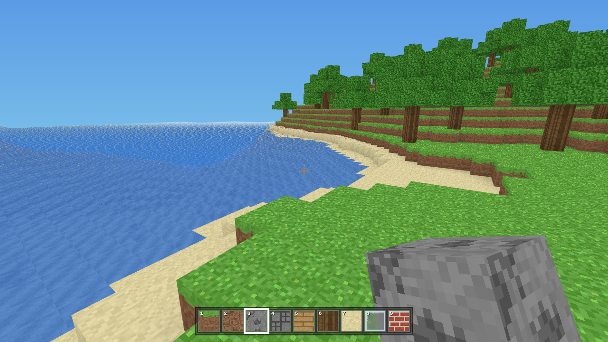

# MCraft

A **Minecraft clone that runs in the browser** — built with plain ES modules and
[Three.js](https://threejs.org/). No build step, no external assets: the textures
are generated procedurally at runtime and Three.js is vendored locally, so the
whole thing runs from any static file server.



## Features

- **Infinite, procedurally generated voxel world** — chunked terrain with hills,
  beaches, oceans, ore veins, bedrock and seamless trees, driven by seeded
  Perlin/fBm noise.
- **Chunk streaming** around the player with face-culled, ambient-occlusion-shaded
  meshes (separate opaque and transparent passes for glass and water).
- **Break & place blocks** — hold-to-break mining with per-block hardness and a
  progressive crack overlay, voxel-DDA raycast targeting and a highlight box.
- **Persistent edits** — your changes are kept across chunk reloads and saved to
  `localStorage`, so builds survive when you wander off and come back (or reload).
- **Movement**: walking with gravity + AABB collision, jumping, sprinting,
  swimming/buoyancy in water, and a creative fly mode.
- **Minecraft-style UI**: hotbar (1–9 / scroll), creative inventory (E),
  inverting crosshair and an F3 debug overlay.
- **18 block types** with procedural textures: grass, dirt, stone, cobblestone,
  oak log/leaves/planks, sand, glass, water, bedrock, coal/iron/gold/diamond ore,
  bricks and snow.

## Controls

| Action | Key |
| --- | --- |
| Move | `W` `A` `S` `D` |
| Look | Mouse |
| Jump | `Space` |
| Sprint | `Ctrl` |
| Break block | Left click |
| Place block | Right click |
| Select block | `1`–`9` or scroll wheel |
| Creative inventory | `E` |
| Toggle fly | `F` (then `Space` / `Shift` for up / down) |
| Debug screen | `F3` |
| Pause / release mouse | `Esc` |

## Running it

The game uses ES modules, so it must be served over HTTP (opening `index.html`
directly via `file://` will not work). Any static server is fine:

```bash
# Python
python3 -m http.server 8080

# or Node
npx serve .
```

Then open <http://localhost:8080> and click **Play**.

### Deploy to GitHub Pages

This repo is already a static site. Enable Pages (Settings → Pages → deploy from
`main` / root) and it will be live at `https://<user>.github.io/mcraft/`.

## Architecture

```
index.html            entry point, importmap, UI overlays + CSS
vendor/three.module.js vendored Three.js r160
src/
  constants.js        world tunables + chunk indexing helpers
  noise.js            seeded PRNG, hash, Perlin noise + fBm
  blocks.js           block registry, hotbar/inventory lists
  textures.js         procedural canvas texture atlas
  world.js            Chunk storage + world-space block access
  worldgen.js         deterministic terrain + tree generation
  mesher.js           voxels -> geometry (face culling + ambient occlusion)
  player.js           camera rig + pointer-lock look + input state
  physics.js          gravity + swept AABB voxel collision
  interaction.js      raycast targeting + break/place
  ui.js               hotbar, creative inventory, debug overlay
  game.js             renderer, chunk streaming, main loop, input wiring
```

The world is divided into 16×16×128 chunks stored as flat `Uint8Array`s. Each
chunk is generated independently and deterministically from world coordinates,
which is what keeps terrain — and trees that straddle chunk borders — seamless.
Meshing emits a face only when its neighbour does not hide it, and shades each
vertex with classic 3-sample ambient occlusion.

## License

MIT for the project code. Three.js is MIT licensed (see `vendor/three.module.js`).
